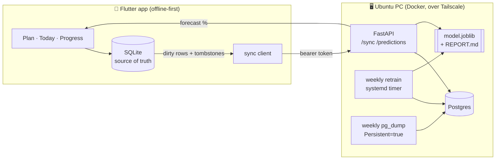

# Telos

**A personal productivity app that also serves as an end-to-end data science project.** Each evening you plan tomorrow's single most important task (MIT) in about 20 seconds. During the day you time it and tick it off. A model trained on your own history forecasts whether tomorrow's MIT will get done.

It covers every stage: data capture design, an offline-first mobile app, a sync API, a Postgres warehouse, leakage-safe feature engineering, honest time-series evaluation, a model served back to the app, and scheduled retraining and backups.

[](https://github.com/lush-is-him/Telos/actions/workflows/ci.yml)

| | |
|---|---|
| 📓 **Analysis notebook** | [`backend/notebooks/telos_analysis.ipynb`](backend/notebooks/telos_analysis.ipynb) |
| 📊 **Generated report** | [`reports/REPORT.md`](reports/REPORT.md) |
| 🧪 **ML code** | [`backend/telos/ml/`](backend/telos/ml) |
| 📱 **App** | [`lib/`](lib) (Flutter) |
| 🖥 **Server + deploy** | [`backend/telos/server/`](backend/telos/server), [`deploy/`](deploy) |

> The published results come from a **synthetic** year generated by a behavioural simulator with planted effects. The same commands run on the live database once real data exists. See [why synthetic first](#why-a-simulator).

## Results (synthetic year, 304 MIT days)

**Question:** when you plan tonight, how likely is tomorrow's MIT to get done?

| Model (walk-forward CV) | Brier ↓ | Log loss ↓ | AUC ↑ | ECE ↓ |
|---|---|---|---|---|
| **Logistic, compact (shipped)** | **0.213** | **0.614** | **0.699** | 0.046 |
| Logistic, all 18 features | 0.220 | 0.631 | 0.670 | 0.046 |
| Baseline: 7-day rolling rate | 0.227 | 0.647 | 0.657 | 0.074 |
| Baseline: "same as yesterday" | 0.230 | 0.652 | 0.598 | 0.047 |
| Gradient boosting | 0.248 | 0.706 | 0.625 | 0.134 |

- **The model beats the best baseline for 5 out of 5 simulated users.** For any single year, though, the 95% block-bootstrap CI on the Brier difference still includes zero (−0.033 to +0.005). The gain is real but modest at this data size, and the report says so rather than overclaiming.
- **The small model wins.** With about 300 rows, the eight features the design doc predicted would matter beat the full set, and gradient boosting overfits the early folds.
- **The pipeline recovers the ground truth.** Refitting the simulator's design recovers **11/11** planted effects inside their 95% CI. This checks that no features leaked and no days were misaligned.
- **Task duration:** a per-category median ties ridge regression and boosting (MAE about 20 min). The app uses the median; the simpler rule wins.
- **Descriptive:** MITs planned the night before are completed 65% of the time, against 35% for same-day plans (n = 253 vs 51). The gap holds after stratifying by whether yesterday's MIT was done.

<p align="center"></p>
<p align="center"> </p>

## Method

**Target.** For each day with a planned MIT: was it marked done?

**Features** ([`features.py`](backend/telos/ml/features.py)). Every feature is either part of the plan (planned the night before? category, number of other tasks, whether the title is specific, days to the next deadline) or history *strictly before* that day (yesterday's MIT, 7- and 28-day rates, streak, recent minutes logged). Nothing from the day itself is used: no completion time, no minutes, no app opens. That is what lets the forecast be shown the night before. [`test_no_leakage_from_the_future`](backend/tests/test_features.py) rewrites every outcome after a cutoff and asserts that the features up to the cutoff don't change.

**Evaluation** ([`evaluate.py`](backend/telos/ml/evaluate.py)):
- Walk-forward CV with an expanding window: train on everything before a cutoff, score the next 14 days, roll forward. Random K-fold would train on the future.
- Every model, baselines included, goes through the same loop.
- Metrics are Brier score, log loss, AUC and expected calibration error (ECE). Calibration matters most here because the app shows the probability itself.
- Model vs baseline uses a **moving-block bootstrap** with 7-day blocks, because days are autocorrelated (streaks). A naive bootstrap would give overconfident intervals.
- The training job **only ships the model if it beats the best baseline**; otherwise it ships the baseline.

**Serving.** The FastAPI server loads the saved model and computes features for the requested day from the synced data. It logs the *first* forecast for each day in `prediction_log`, so live calibration can be scored against real outcomes later.

### Why a simulator

A new user has no history, and a model evaluated only on its own output can't catch a bug that shifts features by one day. [`simulate.py`](backend/telos/ml/simulate.py) generates a year of plausible behaviour with **known** effects: planning the night before, momentum, weekends, overload, vague vs specific titles, deadlines, and a semester cycle the model can't see. Recovering those effects validates the pipeline before real data arrives. It is a test of the code, not evidence about people.

## Architecture



- **Offline-first.** The phone never needs the server. Sync is last-write-wins on `updated_at`, deletes travel as tombstones, and the server applies deletes before inserts so replacing an MIT doesn't trip the one-MIT-per-day index.
- **Constraints live in the database** as well as the UI, on both sides: 1 MIT per day, at most 2 secondary tasks, 1 running timer.
- **Typed warehouse.** The phone stores text dates and 0/1 booleans; Postgres stores `DATE`, `TIMESTAMPTZ` and `BOOLEAN`. Conversion happens at one boundary ([`db.py`](backend/telos/db.py)).
- **Storage** on the phone is about 1 MB per year.

## The app

| Screen | What it does |
|---|---|
| **Plan** | One required MIT, two optional tasks, reusable subject chips. Targets tomorrow after 15:00. Reached from the nightly notification. |
| **Today** | Strike-through on done, one play/pause timer at a time, long-press to correct minutes. The MIT shows its typical duration and the model's forecast. |
| **Progress** | Streak, 26-week heatmap (tap a day to see it), completion rate by weekday with *n*, a "planned often, never finished" subject warning, deadlines. |
| **Settings** | Reminder times, optional morning nudge, server URL/token, sync status, restore-from-server. |

## Run it

```bash
# ML pipeline on synthetic data (≈15 s): simulate → CV → report
cd backend
python -m venv .venv && . .venv/bin/activate      # Windows: .venv\Scripts\activate
pip install -e ".[dev]"
python -m telos.ml demo --end 2026-09-28 --out ../reports
pytest

# App
flutter pub get
flutter test
flutter run

# Home server: see deploy/README.md
```

## Tests

- **Flutter (16):** repository, DB constraints, sync queue and tombstones, a widget-driven plan→do→progress flow, and an opt-in integration test against a live server (push, edit, delete, restore to a fresh phone).
- **Python (10):** sync semantics (last-write-wins, delete-before-insert, auth), a hand-computed feature check, leakage, a walk-forward train/test separation check, the bootstrap, and the prediction endpoint end to end.

## Roadmap

- Score live calibration from `prediction_log` once there are ~60 real forecasts.
- Test whether the night-before effect holds on real data as a within-person comparison.
- Title embeddings for task "specificity" once there are enough real titles.
