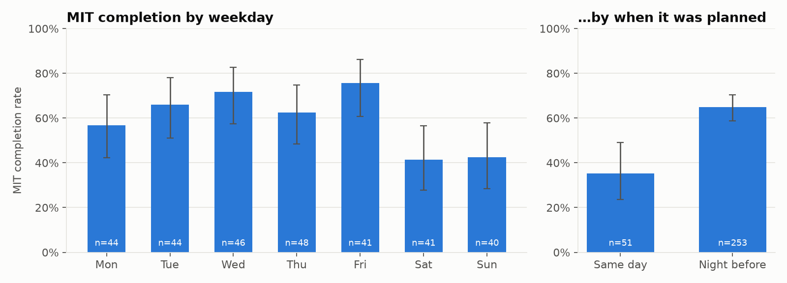
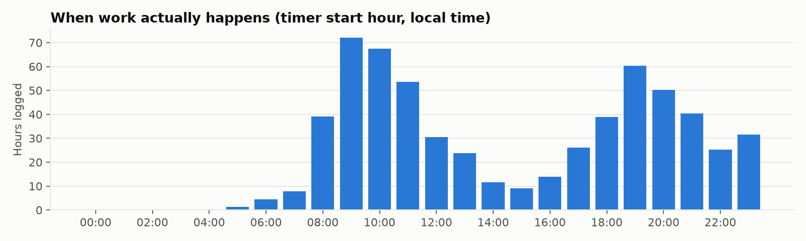
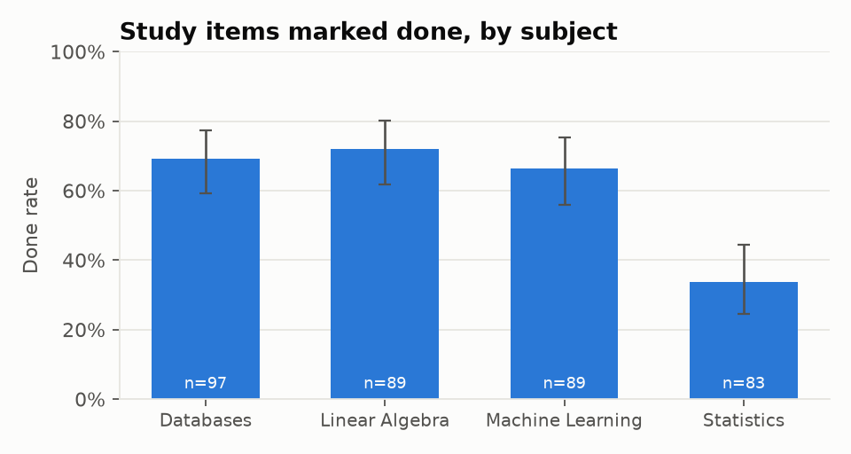
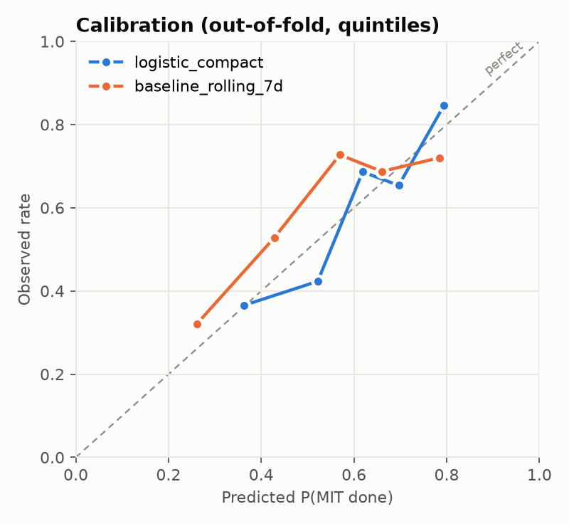
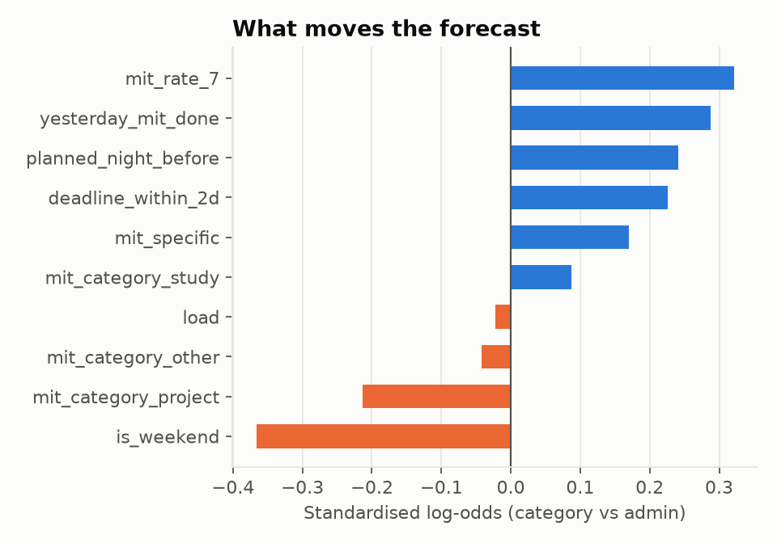

# Telos — analysis report

_Generated 2026-09-29 20:35 UTC._ 

> **Synthetic data.** These numbers come from `telos.ml.simulate`, a seeded behavioural simulator with planted effects. They demonstrate and sanity-check the pipeline; they say nothing about real behaviour. Re-run `python -m telos.ml report` against the live database for real results.

## Data

- 304 days with an MIT, spanning 2025-09-29 → 2026-09-28
- MIT completion rate: 59.9%
- 656 tasks, 358 study items, 1135 timer sessions

## Descriptive

Bars are completion rates with 95% Wilson intervals. Unadjusted: days planned the night before also differ in other ways (they cluster after good days), which is why the model below matters.

## Forecast: will tomorrow's MIT get done?

Walk-forward evaluation: train on every day before a cutoff, score the next 14 days, move the cutoff, repeat. Every prediction below was made without seeing its own future. Lower Brier/log-loss is better.

| model | n | brier | log_loss | auc | ece |
|---|---|---|---|---|---|
| logistic_compact | 259 | 0.2133 | 0.6137 | 0.6992 | 0.0455 |
| logistic_full | 259 | 0.2201 | 0.6309 | 0.6697 | 0.0464 |
| baseline_rolling_7d | 259 | 0.2269 | 0.6467 | 0.6567 | 0.0738 |
| baseline_yesterday | 259 | 0.2300 | 0.6521 | 0.5978 | 0.0475 |
| baseline_base_rate | 259 | 0.2457 | 0.6847 | 0.4453 | 0.0702 |
| gradient_boosting | 259 | 0.2476 | 0.7056 | 0.6254 | 0.1341 |

**logistic_compact** vs **baseline_rolling_7d**: Brier difference -0.0136 (95% block-bootstrap CI -0.0333 to +0.0050, 7-day blocks to respect autocorrelation). The interval includes zero: on this much data the gain over the baseline is not conclusive. Shipped to the app: **logistic_compact**.

## Pipeline check: are the planted effects recovered?

Refit the simulator's exact design (unregularised logistic, Wald 95% CI). If the feature pipeline leaked or mis-aligned days, the estimates would drift away from the truth. 11/11 true values fall inside their interval.

| effect | true | estimate | ci_low | ci_high | true_in_ci |
|---|---|---|---|---|---|
| intercept | -0.90 | -0.69 | -1.58 | +0.20 | True |
| planned_night_before | +0.90 | +0.74 | +0.02 | +1.46 | True |
| yesterday_mit_done | +0.60 | +0.73 | +0.11 | +1.34 | True |
| is_weekend | -0.70 | -0.96 | -1.54 | -0.38 | True |
| load_above_2 | -0.25 | -0.04 | -0.34 | +0.25 | True |
| specific_title | +0.50 | +0.46 | -0.08 | +0.99 | True |
| deadline_within_2d | +0.80 | +0.81 | +0.22 | +1.40 | True |
| category_admin | +0.40 | +0.30 | -0.57 | +1.18 | True |
| category_project | -0.20 | -0.49 | -1.08 | +0.11 | True |
| category_other | +0.20 | +0.02 | -0.96 | +1.01 | True |
| momentum_7d | +0.60 | +0.66 | +0.11 | +1.21 | True |

## How long will it take?

Minutes per completed task, walk-forward. Errors are in minutes.

| model | n | mae_minutes | median_ae_minutes | within_25pct |
|---|---|---|---|---|
| ridge | 353 | 19.91 | 12.76 | 0.38 |
| baseline_category_median | 353 | 19.98 | 13.00 | 0.37 |
| gradient_boosting | 353 | 21.06 | 13.40 | 0.34 |

Best: **ridge**. A per-category median is as good as the learned models, so the app should use the simple rule.
